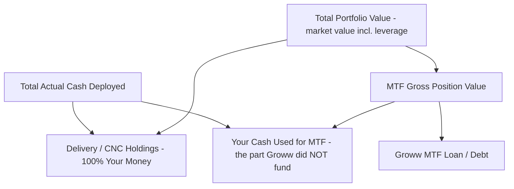
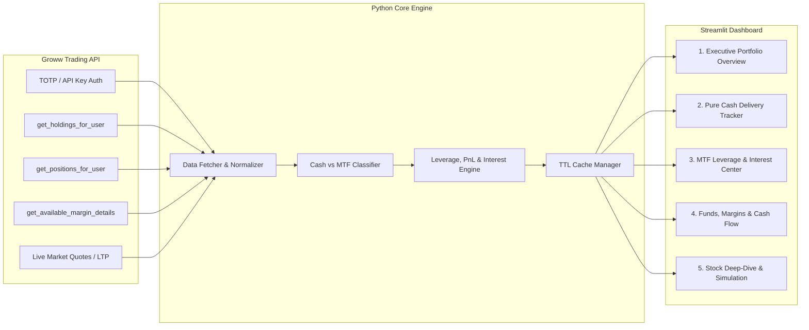
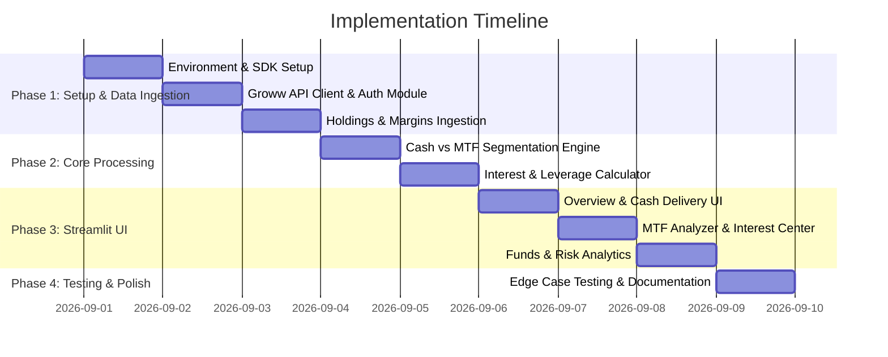

# Groww Portfolio & MTF Analytics Dashboard

A specialized Python Streamlit dashboard designed to analyze and decouple your **Groww** stock portfolio into **Pure Cash Delivery (CNC)** and **MTF (Margin Trading Facility / Pay Later)** holdings.

---

## 1. Executive Summary & Feasibility Verdict

### The Problem

In the official Groww web and mobile platforms, portfolio views typically bundle together long-term cash delivery holdings and MTF (Pay Later) positions into a unified holding list without clearly distinguishing:

- **Actual User Capital Deployed** (Cash paid from your wallet) vs **Broker Funded Capital** (MTF Loan).
- **Pure Cash (Delivery / CNC) Portfolio Value & Returns** vs **Leveraged MTF Portfolio Value & Returns**.
- **Accrued & Ongoing MTF Interest Drag** (~16.5% p.a. / 0.045% per day) on overall returns.
- **Margin Health & Liquidation Distance** (Buffer before margin calls).

### Feasibility Conclusion: **YES (FEASIBLE)**

Based on the official [Groww Trading Python SDK (`growwapi`)](https://groww.in/trade-api/docs/python-sdk), separating and analyzing Cash Delivery vs MTF holdings is **fully feasible** using a combination of API endpoints:

| Objective | Groww API Endpoint / SDK Method | Key Data Fields Utilized |
| :--- | :--- | :--- |
| **Actual Delivery Holdings** | `groww.get_holdings_for_user()` | `demat_free_quantity` (Free), `pledge_quantity` & `repledge_quantity` (Pledged Collateral), `quantity`, `average_price` |
| **MTF (Pay Later) Positions** | `groww.get_positions_for_user(segment=groww.SEGMENT_CASH)` | `net_carry_forward_quantity`, `product`, `net_price`, `realised_pnl` |
| **Account Margins & Funds** | `groww.get_available_margin_details()` | `clear_cash`, `net_margin_used`, `collateral_used`, `collateral_available` |
| **Live Valuation** | `groww.get_ltp()` | Real-time market price for calculating current value, unrealized P&L, and margin health |

---

## 2. Groww API Deep-Dive & MTF Separation Mechanism

### 2.1 How Groww Distinguishes Cash vs MTF Holdings

Per Groww's own product model:

1. **Delivery / CNC Holdings** (`get_holdings_for_user()`):
   - Shares bought entirely with **your own cash**. This is one straightforward number — no leverage, no assumptions.
   - Can optionally be **pledged** (`pledge_quantity` / `repledge_quantity`) as collateral to unlock margin limits for further MTF trading — pledging does **not** change ownership; you still own 100% of these shares.
2. **MTF (Margin Trading Facility) Positions** (`get_positions_for_user(segment=groww.SEGMENT_CASH)`):
   - Shares bought using **margin** — partly your cash, partly a loan from Groww.
   - The real "cash you paid" for MTF (not the pledge collateral, the actual money Groww did *not* fund) is derived from Groww's own margin API (`get_available_margin_details()` → `net_margin_used` minus F&O margin used), **not an assumed percentage split**.

### 2.2 Core Financial Formulas for the Dashboard



#### Key Calculations

1. **Delivery / CNC Holdings** (your money, straight from holdings API — one big number):
   $$\text{Delivery Invested} = \sum (\text{quantity} \times \text{average\_price})$$
   $$\text{Delivery Current Value} = \sum (\text{quantity} \times \text{LTP})$$

2. **MTF Positions** (from positions API — real quantity × price, no assumed leverage):
   $$\text{MTF Cost Basis} = \sum (\text{position quantity} \times \text{net\_price})$$
   $$\text{MTF Gross Value} = \sum (\text{position quantity} \times \text{LTP})$$

3. **Your Cash Used for MTF** (the small number — real, from Groww's margin API, not a guessed 25%/75% split):
   $$\text{Your MTF Cash} = |\text{net\_equity\_margin\_used}| \quad \text{or} \quad \max(0, \text{net\_margin\_used} - \text{net\_fno\_margin\_used})$$
   $$\text{Groww MTF Loan (Debt)} = \text{MTF Cost Basis} - \text{Your MTF Cash}$$

4. **Total Actual Cash Deployed** (the headline number you asked for):
   $$\text{Total Actual Cash Deployed} = \text{Delivery Invested} + \text{Your MTF Cash}$$
   $$\text{Estimated Daily Interest} = \text{Broker Funded Amount} \times \left(\frac{16.5\%}{365}\right) \approx \text{Funded Amount} \times 0.000452$$

5. **Margin Safety Buffer & Liquidation Distance**:
   $$\text{Margin Buffer \%} = \frac{\text{Current MTF Value} - \text{Minimum Maintenance Margin Required}}{\text{Current MTF Value}} \times 100$$

---

## 3. Proposed Dashboard Architecture & Features



### Dashboard Tabs & Visualizations

#### Tab 1: Executive Portfolio Overview

- **KPI Cards**: Total Portfolio Value, Net Equity, Pure Cash Holdings Value, MTF Gross Value, MTF Loan Outstanding, Total Daily Interest Burden.
- **Asset Allocation Charts**: Donut chart comparing Pure Cash Equity vs MTF Equity vs Broker Funded Debt.
- **Combined P&L Summary**: Overall unrealized P&L broken down by Cash vs MTF.

#### Tab 2: Pure Cash Delivery (CNC) Holdings

- **Table View**: Stock symbol, Demat free quantity, Average buy price, LTP, Invested capital, Current value, P&L (₹ and %).
- **Sector & Market Cap Breakdown**: Treemap of free cash holdings.
- **Zero-Risk Hold Analyzer**: Identification of long-term compounders free from margin pressure.

#### Tab 3: MTF (Pay Later) Leverage & Interest Center

- **MTF Exposure Table**: Stock symbol, MTF quantity, Total position value, User margin paid, Broker funded loan, Effective leverage ($2\times$ to $4\times$).
- **Interest Drag Calculator**:
  - Daily, monthly, and yearly projected interest expense per position.
  - Break-even return needed to beat the 16.5% interest hurdle rate.
- **Margin Risk Gauge & Stop Loss Watch**: Distance to margin call threshold per position.

#### Tab 4: Funds, Margins & Liquidity Analysis

- **Groww Balance Tracker**: Available clear cash, utilized margin, collateral margin.
- **Cash Drag & Buffer Management**: Recommended cash reserve to absorb market downturns without triggering forced MTF square-offs.

#### Tab 5: Simulation & What-If Planner

- **Conversion Simulator**: Calculate the cash required to convert MTF positions to full Cash Delivery.
- **Scenario Stress Test**: Simulate portfolio impact if underlying stocks fall by 5%, 10%, or 20%.

---

## 4. Technology Stack

- **Backend / API SDK**: Python 3.10+, `growwapi` (Official Python SDK), `pyotp` (TOTP generation), `requests`.
- **Frontend / Dashboard**: `streamlit`, `plotly` (interactive financial charts), `pandas`, `numpy`.
- **State & Secrets Management**: `python-dotenv` for API keys & TOTP secrets, Streamlit session state and caching (`@st.cache_data(ttl=60)`).

---

## 5. Security & Authentication Setup

Groww provides two authentication flows:

1. **TOTP Flow (Recommended)**: Long-lived TOTP token + TOTP secret (automated with `pyotp`), no daily manual token regeneration required.
2. **API Key & Secret Flow**: Requires daily session initiation.

### Credentials Template (`.env.example`)

```env
# Groww API Credentials
GROWW_API_KEY=your_api_key_or_totp_token
GROWW_API_SECRET=your_api_secret_or_totp_secret
GROWW_AUTH_MODE=TOTP   # or API_KEY

# Optional: Refresh interval in seconds
DASHBOARD_REFRESH_INTERVAL=60
```

---

## 6. Implementation Roadmap



- [x] **Step 1: Feasibility Study & Architecture Documentation** (Completed in this README)
- [ ] **Step 2: Environment Initialization & Dependency Setup** (`requirements.txt`, `.env`)
- [ ] **Step 3: API Service Layer (`services/groww_client.py`)** for authentication and data normalization.
- [ ] **Step 4: Financial Analytics Module (`analytics/mtf_calculator.py`)** for margin, leverage, and interest math.
- [ ] **Step 5: Interactive Streamlit Dashboard (`app.py`, `views/`)** with real-time analytics and visualizations.
- [ ] **Step 6: Fallback Ingestion (CSV / Tradebook import)** to support offline/historical reports.

---

## 7. Next Steps & Review

Please review this feasibility study and architectural blueprint. Once approved, we will proceed directly with setting up the project workspace, building the Groww API integration layer, and implementing the Streamlit dashboard.
